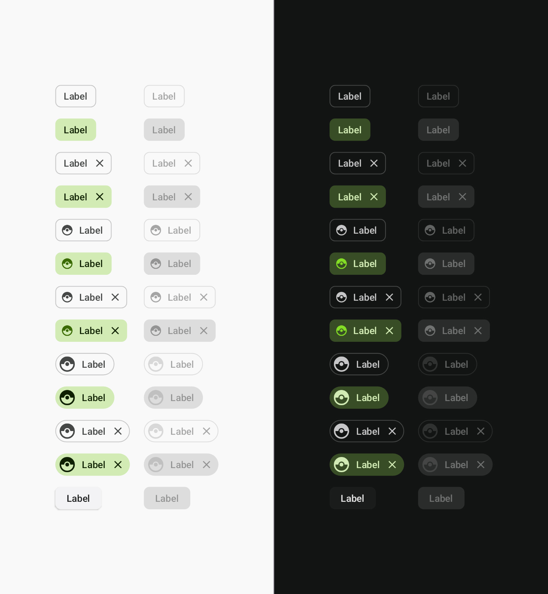

# Material 3 Playground
Android Project with Jetpack Compose previews that help you define your own custom color scheme.

### What is included?
- `design.Color.kt` - Source colors for color schemes
- `design.Scheme.kt` - Color schemes with your custom tone valuess
- `design.SchemeDefault.kt` - Color schemes with default to Material 3 tone values
- `design.SchemeSingle.kt` - White monochromatic color schemes injected with respective color
- `design.SchemeWhite.kt` - White monochromatic color schemes
- `design.Theme.kt` - Material theme
- `compose.colors` - Composables displaying color palette previews
- `compose.components` - Composables displaying component previews
- `preview.PreviewComponents.kt` - All previews of components in a single file
- `preview.PreviewColors.kt` - All previews of color palettes in a single file
- `preview.colors` - All previews of components in a single file but displayed with a respective single-color scheme
- `PrintColorSchemes.kt` - Unit test that generates the output Schemes.kt file.

### How to use it?

- Modify colors listed in `design.Color.kt`.
- Adjust scheme colors in `design.Scheme.kt`.
- Focus on a single color role by using one of the previews in `preview.colors`.
- Check out final result using `preview.PreviewComponents.kt`.
- Compare with standard Material 3 color schemes using `preview.PreviewComponentsMaterial.kt`.
- Display whole color pallet using `preview.PreviewColors.kt`.
- Generate `Schemes.kt` file using `PrintColorSchemes.kt`.

### Screenshots

#### Component previews

    
    
    
    
    
    
    
    
    
    
    
    
    
    
    
    

#### Color scheme preview

#### Color roles previews

###### Primary

###### Secondary

###### Tertiary

###### Neutral

###### Error
